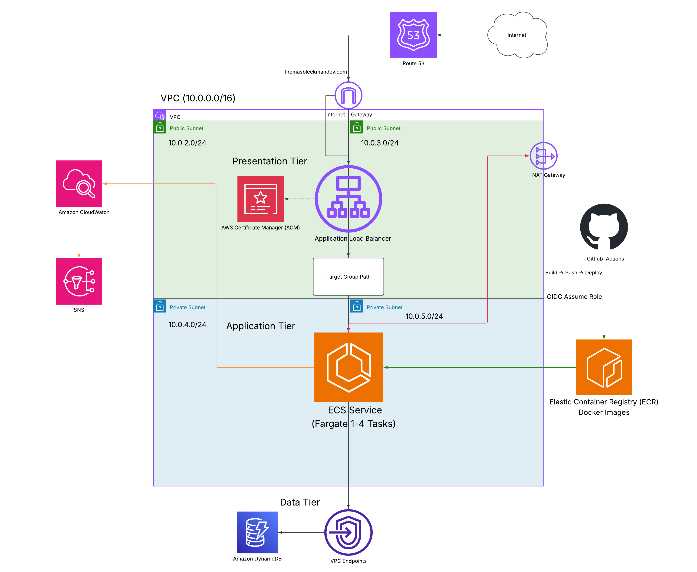

# AWS Terraform Multi-Tier Infrastructure

A production-style AWS infrastructure project built with Terraform that demonstrates networking, load balancing, auto scaling, containerized deployments, monitoring/alerting, security, and CI/CD with Infrastructure as Code best practices.

## Architecture Diagram

Brief Architecture Rundown:

### Presentation Tier
- Route 53
- ACM Certificate
- Application Load Balancer (HTTP --> HTTPS redirect)
- Public Subnets across two Availability Zones

### Application Tier
- ECS Fargate service (2 tasks) across private subnets in two AZs
- Fargate tasks run the containerized Flask app pulled directly from ECR
- Separate IAM roles for task execution and task runtime (least-privilege)

### Data Tier
- DynamoDB table (linkedin user-handles / contact form submissions)
- DynamoDB Gateway VPC Endpoint (private-subnet access without NAT/internet)

### Container Registry
- ECR repository (portfolio-app) with scan-on push enabled
- Fargate tasks authenticate via the ECS task execution role and pull the latest image on startup

### Monitoring & Alerting
- CloudWatch log group with 14-day retention for ECS container/app logs (via awslogs driver)
- CloudWatch Alarms: high ECS service CPU utilization, unhealthy ALB targets
- SNS topic with email subscription for alarm notifications

### CI/CD
- GitHub Actions
- OIDC Authentication (no long-term AWS credentials)
- Terraform fmt, init, plan, validate on push/PR
- Automatic terraform apply on merge to main

Infrastructure Details:

- Networking
	* 4 subnets under a VPC (2 public and 2 private) across two Availability Zones
	* IGW and NATGW
	* Public subnets route to the IGW via the main route table
	* Private subnets route to the NATGW via the private route table
	* DynamoDB Gateway Endpoint attached to the private route table

- Frontend
	* ALB deployed across both public subnets
	* Security Group allows inbound HTTP/HTTPS and all outbound traffic
	* R53 record points the domain at the ALB
	* ACM certificate secures HTTPS
	* ALB listener redirects HTTP to HTTPS; HTTPS listener forwards to the target group
	* Target group (type:ip) performs health checks and routes traffic to ASG instances on port 5000

- Application
	* ECS Fargate service (desired count: 2) spans both private subnets
	* Tasks use awsvpc networking mode -- each task gets its own ENI and private IP
	* Fargate pulls the portfolio-app image from ECR on task startup (no EC2, no user data)
	* Each task runs a Flask app (via Guinicorn) on port 5000
	* Flask app (boto3) handles contact form submissions and writes entries to DynamoDB
	* Two IAM roles follow the principle of least privilege
		* Task Execution Role: grants ECS the ability to pull images from ECR and ship logs to Cloudwatch
		* Task Role: grants the running container DynamoDB access only (GetItem, PutItem, UpdateItem, Query, DescribeTable)
	* ECS security group allows inbound TCP 5000 from the ALB security group only, and all outbound traffic

- Database
	* DynamoDB table to store LinkedIn user-handles (name, LinkedIn, message, timestamp, UUID)
	* Pay-per-request, single-attribute hash key
	* Reached privately from the Fargate tasks via a Gateway VPC Endpoint -- no internet egress required

- Monitoring & Alerting
	* CloudWatch log group (/ecs/portfolio/app) collects container logs via the awslogs log driver
	* High CPU alarm on the ECS service (>80% over 2 periods) triggers SNS notification
	* Unhealthy target alarm on the ALB target group triggers SNS notification
	* SNS topic emails alerts to the project owner

Infrastructure Workflow:

1. Traffic Hits my domain (thomasbleckmandev.com)
2. Route 53 resolves to my IGW
3. IGW routes traffic towards my ALB listeners (if requested by HTTP --> redirect into HTTPS)
4. ALB Listener directs traffic towards ALB target group
5. Target group route traffic to a healthy Fargate task on port 5000
6. The Fargate task runs the portfolio-app container (pulled from ECR on startup), serving the Flask app via Gunicorn
7. For contact form submissions, Flask writes the entry to DynamoDB via the Gateway VPC Endpoint
8. Cloudwatch collects container logs via awslogs; alarms notify via SNS if thresholds are breached
9. Response traffic returns through the ALB back to the user

CI/CD:

	* Utilizes Github Actions on pushes to test/main and PRs targeting main
	* OIDC for Github to access my remote backend (no stored secrets)
	* Pipeline runs terraform fmt -check, init, plan, and validate on every run
	* On merge to main, the pipeline automatically runs terraform apply -auto-approve

## Lessons I've Learned
- Importance of logging
	* While integrating Docker into my ASG to containerize my application, my instances were healthy, yet I couldn't connect to my website, its health subdomain, or use SSM to find the issue
	* From using the EC2 logs, however, I was able to identify that the issue was that the EC2 instances didn't have enough space to download Docker (it was just using root instance volume), and solved the issue from there (booting EC2 with an EBS volume)
	* Understood the importance of troubleshooting via logs
- Migrating from EC2/ASG to ECS Fargate
	* Moving to Fargate eliminated the need to manage EC2 instances, AMIs, launch templates, and user data scripts
	* The shift required creating two separate IAM roles (execution role vs. task role) to maintain least-privilege, since the EC2 instance profile pattern doesn't apply to Fargate
	* awsvpc networking mode means each Fargate task gets its own ENI, so the security group model is simpler and more precise than with EC2
- Making a diagram to represent my infrastructure
	* A README just giving the workflows and infrastructure are important, but it does not give a first-time looker a holistic view of how the infrastructure welds together
	* Diagram accomplishes exactly that, reducing the time it takes for someone to understand my project, as well as making the worklfow of it easier to understand
- Turning code into modules
	* With me learning terraform as I've worked on this project, I lacked the intuition of making the actual components of this infrastructure reusable. Upon learning and implementing it, however, I understand its importance; I have more standardized attributes across the components leading to less confusion.
	* Additionally, now that the components are isolated in their own modules, it makes finding and seeing each aspect of the infrastructure easier to understand.
	* Now understanding the amount of reusability, simplicity, and scalability with modules, I wish I would have implemented it sooner rather than later. Therefore, organizing a terraform project such as this into modules in the beginning is also a crucial lesson.

Possible Next Steps
* Update architecture diagram to reflect the ECS Fargate architecture