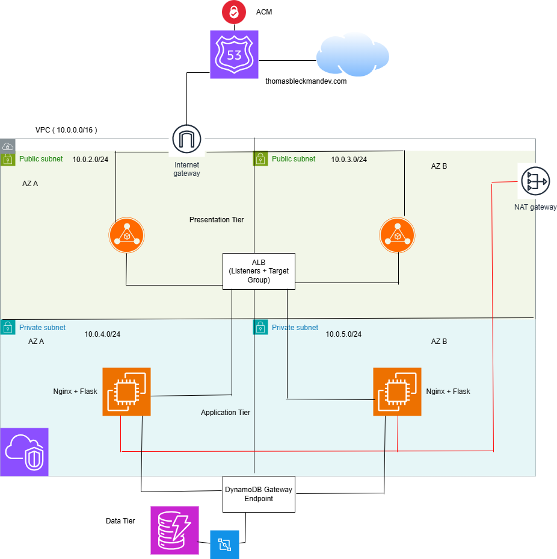

# AWS Terraform Multi-Tier Infrastructure

A production-style AWS infrastructure project built with Terraform that demonstrates networking, load balancing, compute, security, CI/CD, and Infrastructure as Code best practices.

## Architecture Diagram

Brief Architecture Rundown:

### Presentation Tier
- Route 53
- ACM Certificate
- Application Load Balancer
- Public Subnets across two Availability Zones

### Application Tier
- EC2 Instances in private subnets
- Nginx web server
- Flask API backend
- Boto3

### Data Tier
- DynamoDB
- DynamoDB Gateway Endpoint

### CI/CD
- GitHub Actions
- OIDC Authentication
- Terraform Validate / Plan

Infrastructure:

- Networking
	* 4 subnets under a VPC (2 public and 2 private)
	* IGW and NATGW
	* Public subnets having routing associations with the main route table to the IGW
	* Private subnets having routing associations with the private route table to the NATGW

- Frontend
	* ALB in public subnets
	* Security Group for the ALB to accept inbound http(s) traffic and allow all outbound
	* R53 records established for online connection
	* Certificate for website via ACM
	* ALB listeners redirects HTTP to HTTPS traffic to the target group
	* Target groups route traffic towards the EC2 instances in the private subnets by HTTP
	* Website served statically via nginx on EC2 instances
	* Option for users to input their name, handle, and description to be stored in a DynamoDB table

- Application
	* 2 EC2 instances hosted on separate private subnets
	* EC2 defined by AMI (Amazon Linux, most recent)
	* Instances use T3 Micro
	* Hosts static website via nginx, Flask, and Boto3
	* Sends API calls for inputs on website to DynamoDB via gateway endpoint
	* Allows all egress outbound and tcp ingress

- Database
	* DynamoDB
	* Connected to EC2 instances through port 80 TCP
	* When users put their handles through the frontend, the api request is forwarded to DynamoDB to store

Infrastructure Workflow:

1. Traffic Hits my domain (thomasbleckmandev.com)
2. Routes to my IGW
3. IGW routes traffic towards my ALB listeners (if requested by HTTP --> redirect into HTTPS)
4. ALB Listener directs traffic towards ALB target group
5. Target group route traffic to EC2 instance in private subnet via HTTP
6. EC2 ingress takes in traffic and serves requested website via nginx
7. a. Users can optionally add their name, handle, and a description to an input box
7. b. Input is sent from EC2 to DynamoDB via a gateway endpoint, and confirms to user it was either successful or unsuccessful
8. Traffic goes out EC2 egress and routes in reverse back to the user

CI/CD:

	* Utilizes Github Actions
	* OIDC for Github to access my remote backend
	* Two branches for workflow: test and main
	* Test branch for testing changes with terraform fmt, init, and plan
	* Main branch to be merged with for production with terraform apply

